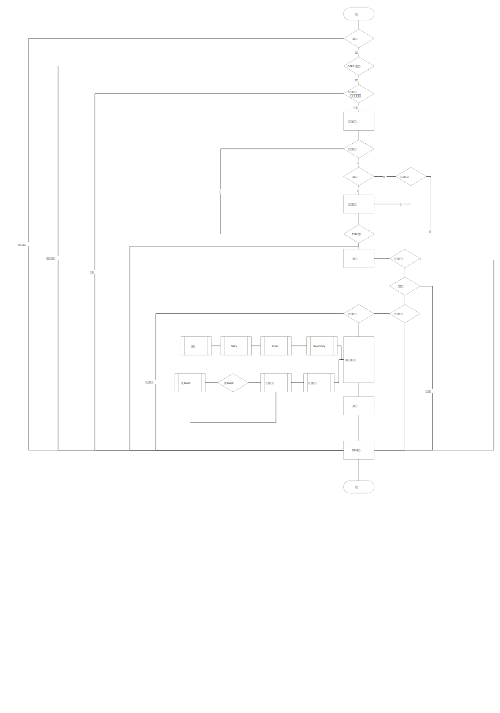

## 请求周期



### 基于中间件的流程

```php

$app = new Web()
$app->middleware(Middleware::class)
$app->middleware(function($req, $resp, $next))
$response = $app->handle($uri)
    DomainMiddleware       // 是否允许当前域名
        CORSMiddleware     // 跨域验证
            CacheMiddleware    // 静态缓存检测
                GZIPMiddleware   // 压缩输出
                    RewriteMiddleware   // 重写解析还原真实
                        RouterMiddleware   // 路由解析，下一步到控制器
                            MatchRouteMiddle
                                [any]Middleware
                            ModuleMiddleware
                            DefaultRouteMiddle
                                Controller
                                    CSRFMiddleware
                                        RuleMiddleware  // 控制器中的规则过滤
                                            AuthMiddleware        // 登陆验证
                                            HttpMethodMiddleware  // 请求方式验证
                                            RoleMiddleware      // 角色验证
                                                UriParameterMiddleware // 方法参数过滤
                                                    ResponseBodyMiddleware   // 加密解密
                            
$response->send();

```